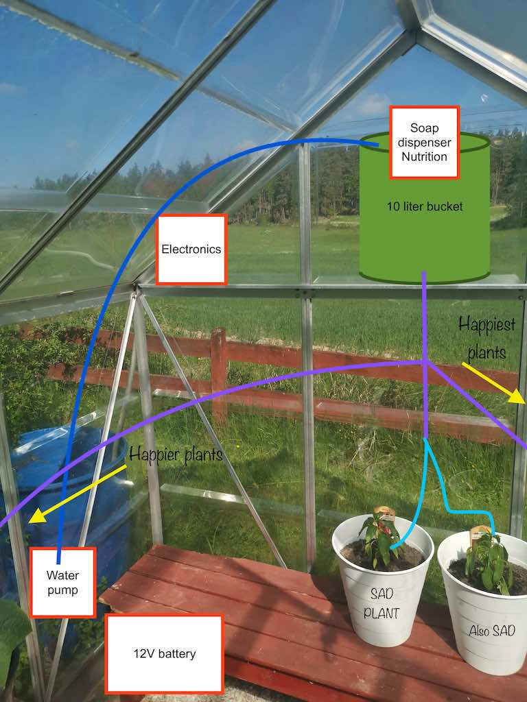
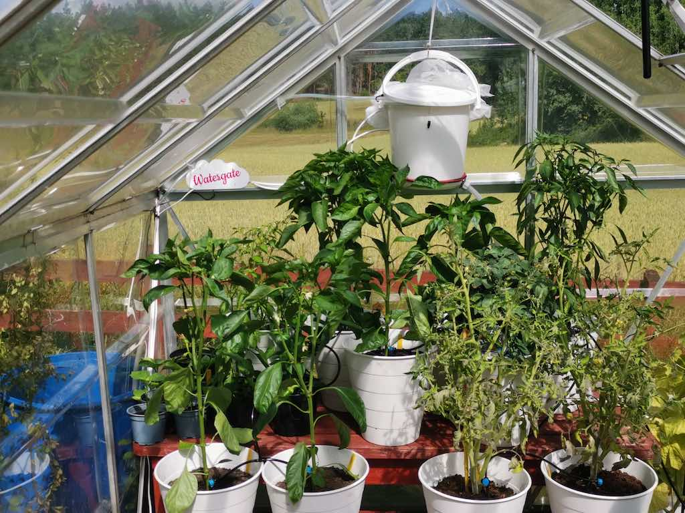
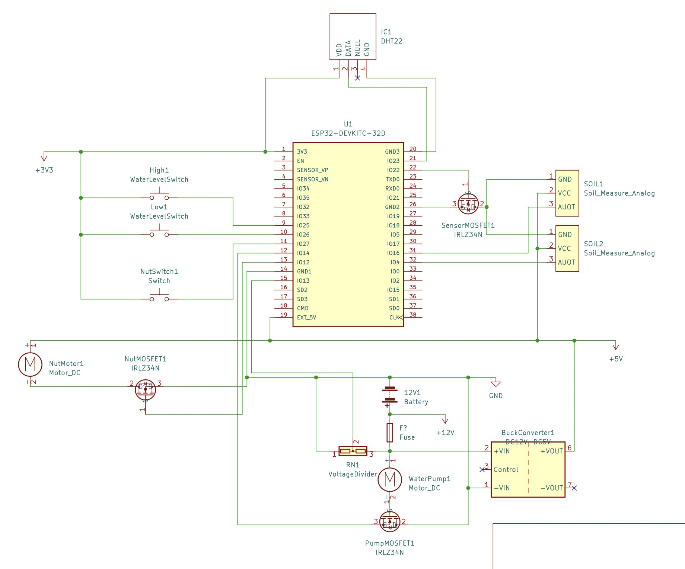

# Watergate

A growhose helper. Sensors and watering of plants with added nutrition. 

# Configuration

WiFi config set using WiFi Manager by connecting to network Watergate on first boot.

**gmtOffset_sec**

Adjustment in seconds from GMT

**waterHour**

Array of hours when automatic watering should be done

## MQTT

Setup to use Adafruit IO service.

Configure username, password and topic by creating a *config.h* file with the following defines:

    #define MQTT_USER ""
    #define MQTT_PASSWORD ""
    #define MQTT_TOPIC ""

# Hardware

ESP32 devkit.

DHT22 temperature and humidity sensor.

12v AGM battery.

12v 5w water pump.

Hygrometers for measuring soil humidity.

Buck converter for getting 5v from 12v battery.

Simple voltage divider for checking battery level.

MOSFETs for controlling pump, motor and sensors.

Water level sensors.

# Schematics

First time using KiCad to help with construction.

# Software

Written in Arduino IDE 2.0.

Coded in C.

# Enclosures

Made in Fusion 360 with main purpouse to protect electronics from direct sunligt.

https://a360.co/3csUwN7

# Libraries

These libraries needs to be installed in Arduino IDE to be able to build.

**FTDebouncer** by Ubi de Feo

https://github.com/ubidefeo/FTDebouncer

**DHT sensor library** by Adafruit

https://github.com/adafruit/DHT-sensor-library

**WiFiManager** by tzapu

https://github.com/tzapu/WiFiManager

**PubSubClient** by Nick O'Leary

https://github.com/knolleary/pubsubclient

**DallasTemperature** by Miles Burton

https://github.com/milesburton/Arduino-Temperature-Control-Library

**OneWire** by Jim Studt, ...

https://www.pjrc.com/teensy/td_libs_OneWire.html