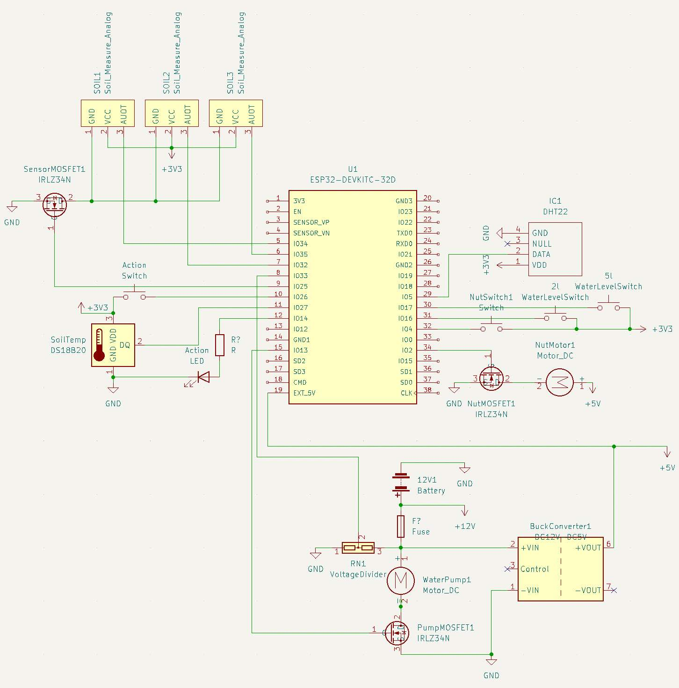

# Watergate

A growhose helper. Sensors and watering of plants with added nutrition. 

# Configuration

None so far.

# Hardware

ESP32.

DHT temperature and humidity sensor.

12v battery from lawnmover.

Different types of hygrometers for measuring soil humidity.

Buck converter for getting 5v from 12v battery.

Simple voltage divider for checking battery level.

MOSFETs for controlling pump, motor and sensors.

# Schematics

First time using KiCad to help with construction.

# Software

Written in Arduino IDE 2.0.

Coded in C.

# Enclosures

Non so far.

# Libraries

These libraries needs to be installed in Arduino IDE to be able to build.

**FTDebouncer** by Ubi de Feo

https://github.com/ubidefeo/FTDebouncer

**DHT sensor library** by Adafruit

https://github.com/adafruit/DHT-sensor-library